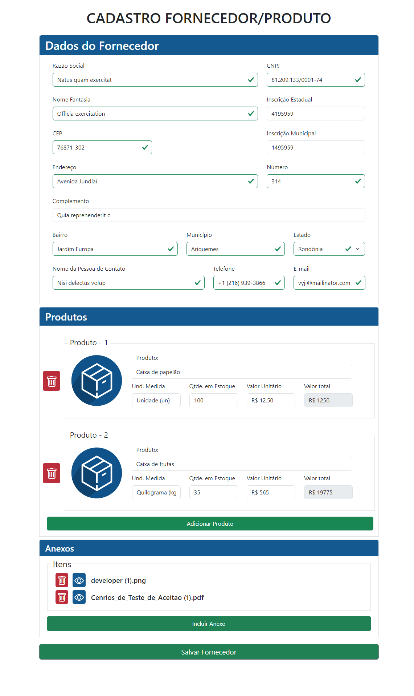
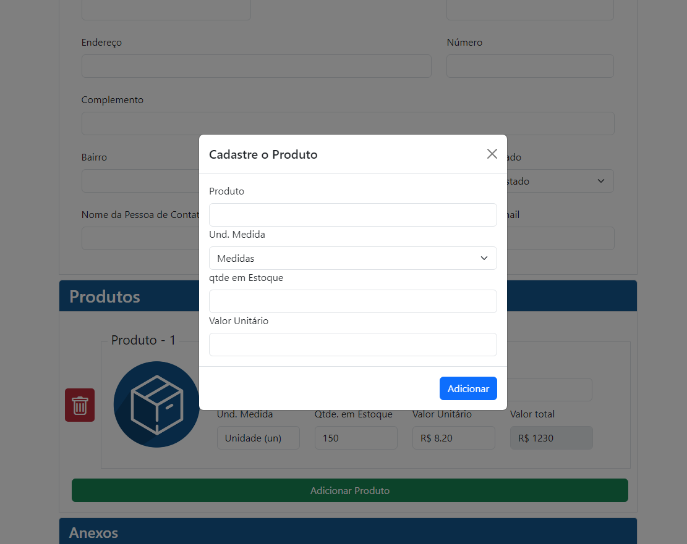
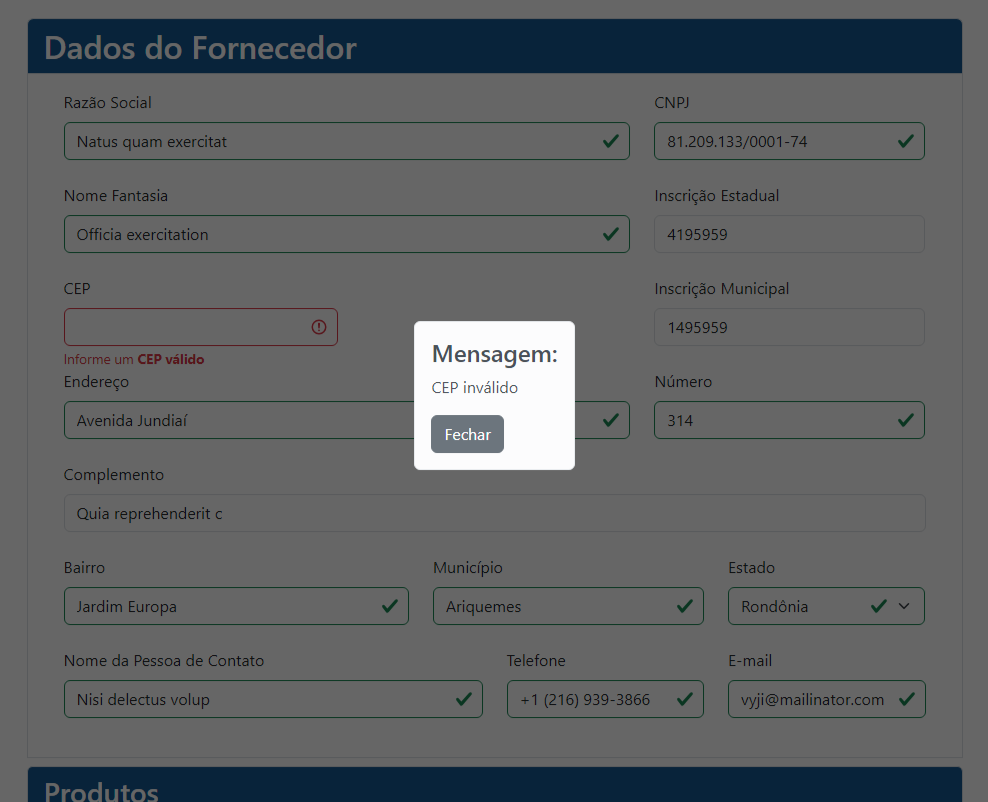
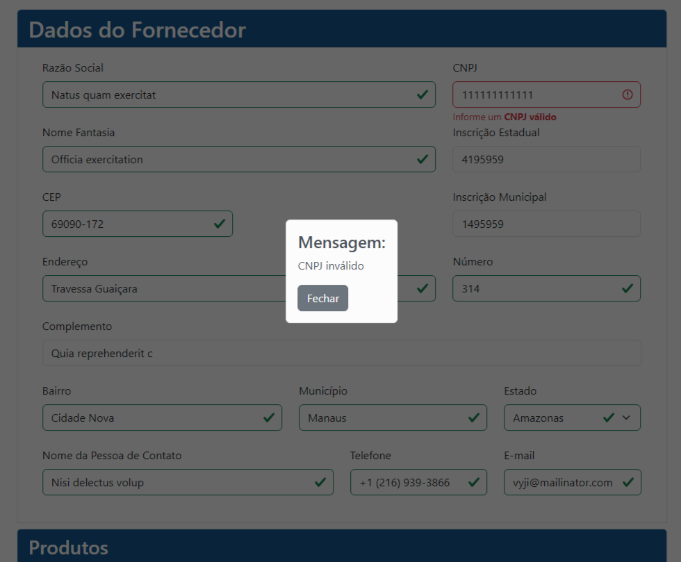
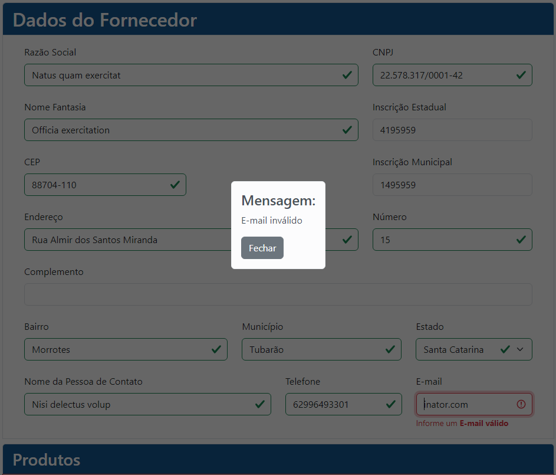
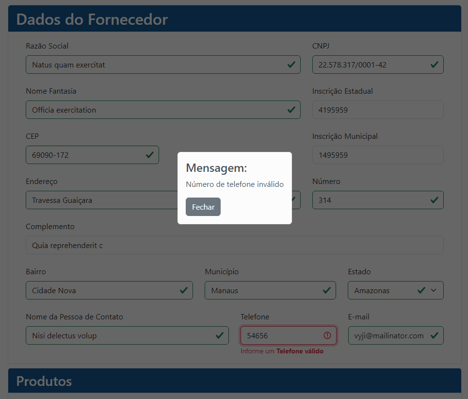
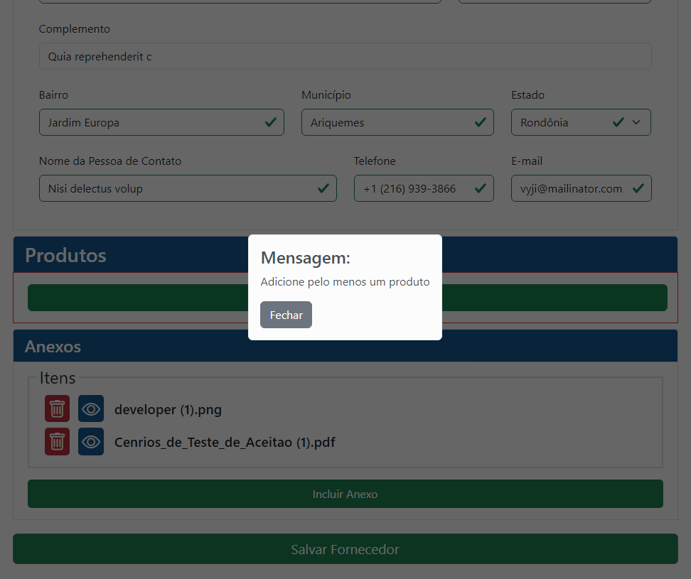
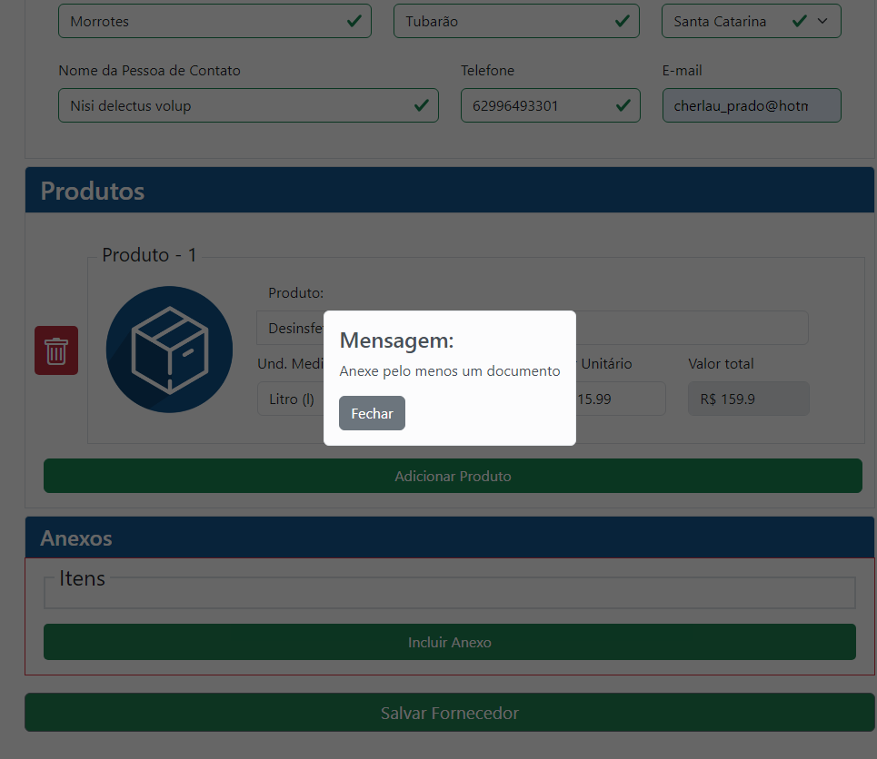
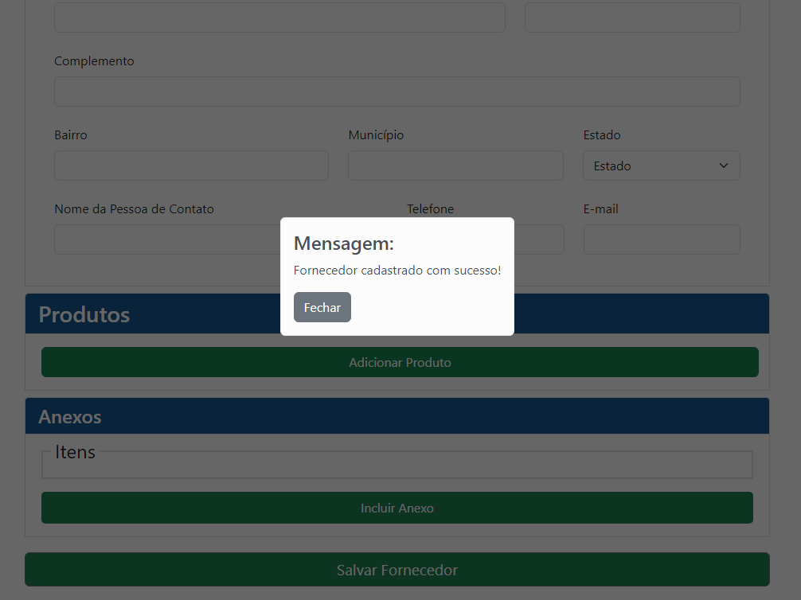
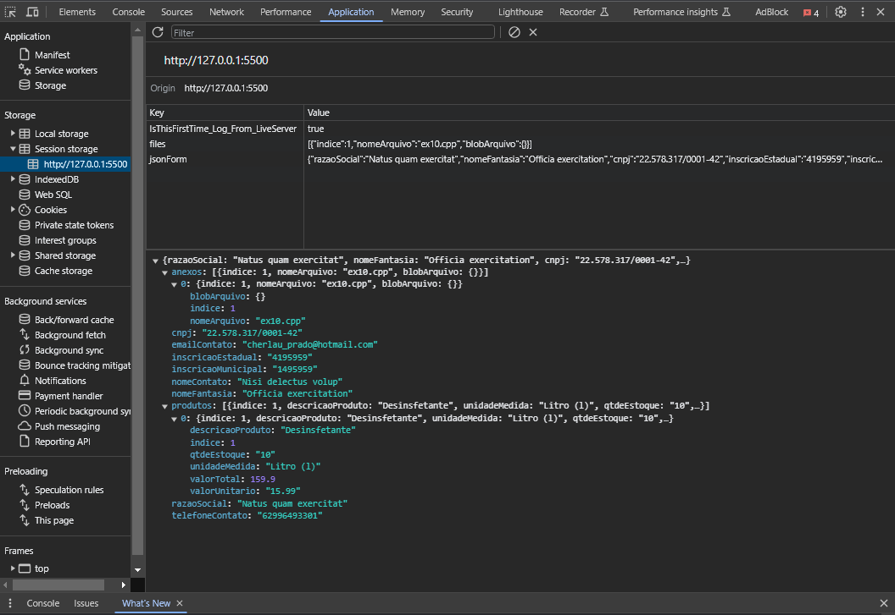

<h1 align="center">Desafio Front-End - Formulário de Cadastro</h1> 

<h3 align="center">
⚙️ Tecnologias utilizadas

&nbsp;

</h3>

 

## Desafio - Formulário de Cadastro de Fornecedor

* <strong>API de CEP:</strong> Busca automaticamente e preenche os campos de Estado, Cidade, Bairro e Rua.

* <strong>Adição de Produtos:</strong> adiciona (ou excluí) múltiplos produtos em lista, com Descrição, Preço, Quantidade e Preço total.

* <strong>Upload de arquivos:</strong> Adiciona (ou excluí) arquivos que serão armazenados em formato BLOB no localStorage e podem ser baixados.

* <strong>Validação de CNPJ:</strong> Validação automática no preenchimento do campo.
  
* <strong>Geração de JSON:</strong> Ao Submeter o formulário, todas as informações inseridas serão convertidas em formato JSON para possivel envio ao banco de dados.
  
* <a href="https://cadastro-fornecedor-cherlau.web.app/" target="_blank"><h4>Confira: https://cadastro-fornecedor-cherlau.web.app/</h3></a>

 
 

## 🚧 Projeto

  

  

## ✔️ Validações

  

  

  

  

  

  

  

&nbsp;

## 📌 JSON

  

&nbsp;

## 📜 Certificação durante o projeto

  

&nbsp;

---

## ✒️ Autor

| [    Cherlau Prado ](https://github.com/cherPrado) |
| :--------------------------------------------------------------------------------------------------------------------------------------------: |

<h2 >Entre em contato 🤙🏽</h2>

